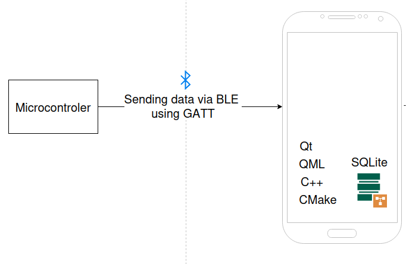

# Opis projektu

Projekt stanowi rozwinięcie prac nad systemem Ear EEG, którego celem jest rejestracja, transmisja 
oraz wizualizacja sygnałów elektroencefalograficznych pozyskiwanych z elektrod umieszczonych w obrębie 
ucha.
W trakcie realizacji projektu zdecydowano się na celowe rozdzielenie architektury systemu na dwa 
komplementarne strumienie rozwojowe, co umożliwiło równoległy rozwój toru pomiarowego oraz warstwy 
aplikacyjnej, a także przyspieszyło proces testowania i walidacji rozwiązania.

## Podział projektu na dwa etapy rozwojowe

**Etap A**: Tor pomiarowy EEG (hardware + akwizycja danych)

Pierwszy strumień projektu koncentruje się na fizycznym pomiarze sygnałów EEG.
Obejmuje on połączenie elektrod EEG z dedykowanym układem pomiarowym oraz transmisję danych 
do komputera w celu dalszej analizy.
Etap ten odpowiada za pozyskiwanie danych rzeczywistych i stanowi docelowe źródło sygnałów EEG 
w systemie.
Poniższy projekt jest rozwinięciem projektu, w którym realizujemy tor pomiarowy dla Ear EEG. 

**Etap B**: Platforma aplikacyjna i symulacyjna EEG

Drugi etap projektu skupia się na opracowaniu aplikacji umożliwiającej wizualizację sygnałów EEG 
w czasie rzeczywistym oraz na stworzeniu środowiska pozwalającego na jej rozwój niezależnie 
od fizycznego toru pomiarowego.
W tym celu zastosowano mikrokontroler z firmware symulującym sygnały EEG, który przesyła dane 
do aplikacji za pomocą komunikacji Bluetooth Low Energy (BLE). Takie podejście umożliwia 
testowanie interfejsu użytkownika, mechanizmów buforowania oraz synchronizacji danych bez konieczności 
ciągłego korzystania z docelowego sprzętu pomiarowego.

### Wspólny model danych

Oba etapy projektu wykorzystują wspólny model danych EEG, co umożliwia płynne przejście od danych 
symulowanych do danych rzeczywistych bez konieczności zmiany architektury aplikacji.
Dzięki temu aplikacja jest projektowana jako platforma niezależna od źródła danych, 
przygotowana do integracji z docelowym torem pomiarowym w kolejnych etapach projektu.

## Schemat projektu

## Komponenty systemu
Komponenty systemu można podzielić na 4 warstwy

**Warstwa 1**: Dane - ich żródło oraz przechowywanie
- mikrokontroler z firmware symulującym EEG (docelowo nRF52840; na obecnym etapie wykorzystywany ESP32)
- wspólny format danych
- plik z danymi EEG (offline)
- zapis innych danych pomocnicznych do SQLite

**Warstwa 2**: Transport danych (komunikacja aplikacja–mikrokontroler)
- BLE
- protokół ramek danych EEG (GATTA)

**Warstwa 3**: Logika aplikacji
- parser danych EEG
- buforowanie i synchronizacja
- zarządzanie sesją pomiarową

**Warstwa 4**: Prezentacja
- wizualizacja przebiegów
- interakcja użytkownika
- elementy biofeedbacku

## Model danych EEG
Dane EEG w Strumieniu B są reprezentowane w postaci strumienia ramek zawierających próbki 
wielokanałowe wraz z informacją czasową. Taki model umożliwia jednolitą obsługę danych zarówno 
symulowanych, jak i rzeczywistych.

## Analiza ryzyka
| Element | Co może pójść źle | Skutek |
| -- | -- | -- |
| BLE | utrata pakietów | artefakty w sygnale | 
| Parser | błędna ramka | przesunięcie danych |
| UI | lag | błędna interpretacja |
| Zapis danych | brak zapisu | utrata sesji |
