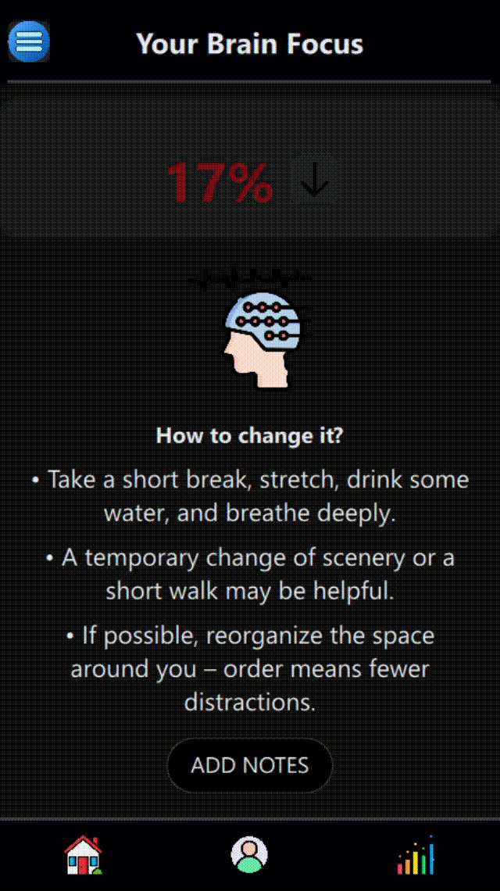

# Project Description

This project is a continuation of work on the Ear EEG system, which aims to record, transmit, and visualize electroencephalographic signals obtained from electrodes placed around the ear. During implementation, the system architecture was intentionally divided into two complementary development streams. This allowed for the parallel development of the measurement path and the application layer, while accelerating the testing and validation process.

## Project Division into Two Development Stages

**Stage A**: EarEEG Measurement Path (Hardware)

The first part of the project focuses on constructing and launching the hardware layer responsible for the physical measurement of EEG signals. This process involved assembling electronic components purchased through a mini-grant obtained from [the Laboratorium Pomysłów (Idea Lab) at the University of Warsaw (UW)](https://iuw.edu.pl/laboratorium-pomyslow-final-programu-i-prezentacje-najlepszych-projektow/).The work on this part was carried out independently and served as the foundation for further activities.

The primary inspiration for the measurement path was [the OpenBCI project](https://pmc.ncbi.nlm.nih.gov/articles/PMC9529594/#ab010), from which specialized electrodes were also purchased. The heart of the system is the ADS1299 evaluation board from Texas Instruments (TI). The entire system was successfully launched and configured using TI's dedicated software.

This stage includes connecting the electrodes to the measurement system and transmitting data to a computer. Detailed information and documentation for this stage can be found [here](https://www.instructables.com/Ear-EEG-OpenBCI-CEEGrid-ADS1299EEGFE-PDK/).

**Stage B**: EEG Application and Simulation Platform (Available in this repository)

The second stage of the project focuses on developing an application that enables real-time visualization of EEG signals and creating an environment for its development independent of the physical measurement path. To achieve this, the application utilizes training data provided by [OpenBCI](https://github.com/MKnierim/openbci-ceegrids/blob/main/code/data/training_data_cut.csv). This approach allows for testing the user interface, buffering mechanisms, and data synchronization without the continuous need for the target measurement hardware.

### Common Data Model

Both project stages enable the use of EEG data from various sources. The application has been designed with a modular architecture, allowing for easy expansion and integration of new data sources without requiring significant changes.

  

## System Components
The system components are divided into three layers:

**Layer 1**: Data - Source and Storage
- EEG data file (offline)
- Saving auxiliary data to SQLite
- Logs necessary for monitoring operation

**Layer 2**: Application Logic
- EEG data parser
- Buffering and synchronization
- Measurement session management

**Layer 3**: Presentation
- Waveform visualization
- User interaction
- Biofeedback elements

## ⚖️ License

This project is licensed under the Apache License, Version 2.0 (the "License").

You may obtain a copy of the License at: http://www.apache.org/licenses/LICENSE-2.0
